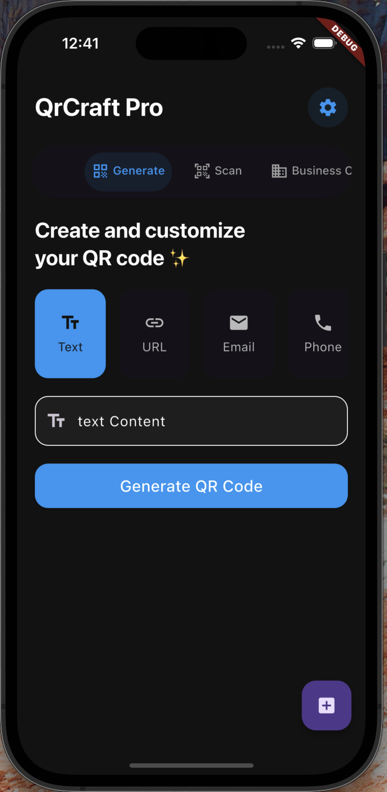
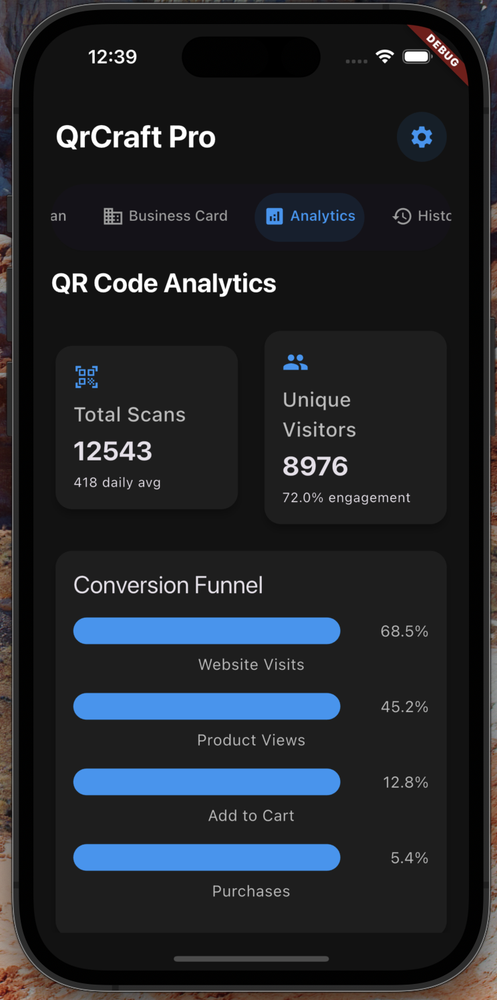

# QrCraft Pro

  

QrCraft Pro is a powerful and feature-rich QR code generator and scanner application built with Flutter. It offers advanced customization options, batch processing capabilities, and comprehensive analytics for your QR codes.

## ✨ Features

### 🎨 QR Code Generation
- Multiple QR code types support:
  - Text
  - URL
  - Email
  - Phone
  - WiFi credentials
  - vCard/Business Card
  - Calendar events
  - Location coordinates
  - Cryptocurrency addresses
  - WhatsApp links
  - And more...

### 🎯 Advanced Customization
- Custom colors and gradients
- Different QR patterns and shapes
- Adjustable dot sizes
- Custom logo embedding
- Multiple templates
- Error correction levels

### 📊 Analytics & Tracking
- Scan statistics
- Time distribution analysis
- Device type tracking
- Conversion funnel
- Engagement metrics
- Real-time analytics

### 💼 Business Features
- Digital business card creation
- Batch QR code generation
- CSV import/export
- Vector format (SVG) export
- History tracking
- Cloud backup

### 🔍 Scanner Features
- Fast and accurate scanning
- History logging
- Auto-action detection
- Multiple format support
- Batch scanning

## 📱 Screenshots

  
  
  
  

## 🛠️ Technical Details

### Architecture
- Clean Architecture
- Provider for state management
- Repository pattern for data handling
- Service-based analytics integration

## 🔐 Privacy & Security

- No personal data collection
- Offline-first approach
- Optional analytics
- Secure QR code generation
- GDPR compliant